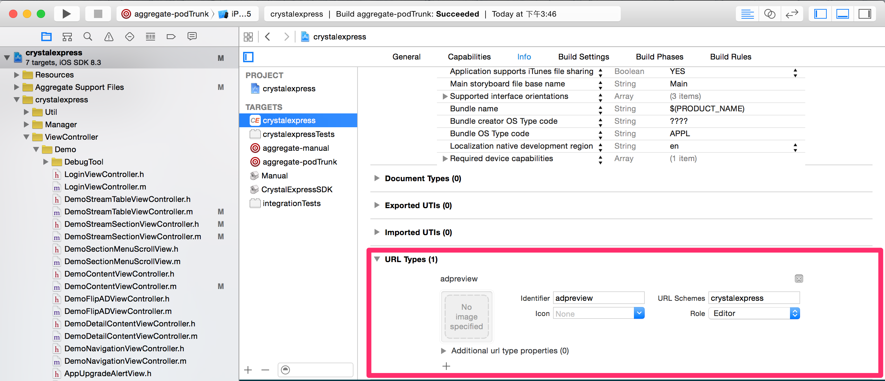

基於 iOS 深度連結 (Deeplink)，透過掃描 QRcode，我們可以在真的 App 上預覽廣告的效果。範例 QRcode 的網址如下:
```
{urlScheme}://crystalexpress?action=adpreview?adid={number}
```
CrystalExpress SDK 會處理 adpreview 的網址, 並且忽略其他網址

## 配置步驟 


1. 首先你需要在您的 App 裡設定一個 URL scheme，於 Project -> Info -> URL Types，填入您 App 的 urlScheme 以及其他欄位
2. 將 urlScheme 告知您的 intowow 聯絡窗口，待 CrystalExpress&trade; 平台設定完成後方可進行預覽測試。 
3. 將下列代碼添加到 AppDelegate.m，啟用 CrystalExpress 的廣告預覽功能

```objc
- (BOOL)application:(UIApplication *)application
                        openURL:(NSURL *)url
    sourceApplication:(NSString *)sourceApplication
                annotation:(id)annotation
{
        [I2WAPI handleDeepLinkWithUrl:url sourceApplication:sourceApplication];

        .....
        return YES;
}
```

## 預覽測試步驟
1. 透過 CrystalExpress&trade; 後台上稿後，每個廣告都會產生一組 QRCode。
2. 開發人員用實體手機掃瞄此 QRCode 後將開起 SDK 預覽模式，並且可以看到所要求的廣告。
3. 測試完成後需強制停止 App，此時 SDK 將離開預覽模式。
